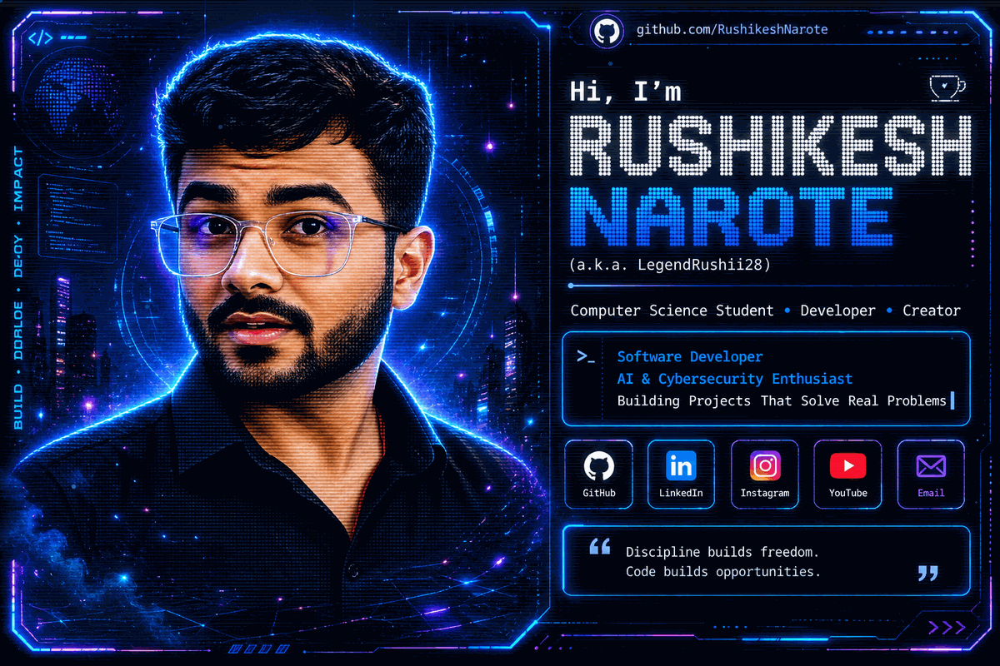

  

---

## 👨‍💻 About Me

I'm **Rushikesh Narote**, a Computer Science student at **VIT Pune** interested in Full Stack software development, AI and cybersecurity.

- 🎓 Love doing projects in SpringBoot and MERN
- 💻 Building software and Artificial Intelligence-based projects 
- 🧠 Improving DSA and problem-solving
- 🚀 Learning ML and cybersecurity

---

## 🛠️ Tech Stack

### Languages

### Web & Backend

### Database & Tools

### Other

